# My Money

A multi-user desktop application for personal and household finance management, built as a bachelor's thesis at the University of Pardubice.

My Money started as a simple personal expense tracker and grew into a household-oriented finance system: multiple users share one workspace under a role model (Admin / Partner / Child), each with their own access rights, private and shared money contexts, savings goals, and a rule-based analytics engine that turns raw spending data into explainable insights and a Financial Health Score.

Built with C# / .NET 10, WPF (MVVM), a service + repository architecture, dependency injection, and a local SQLite database.

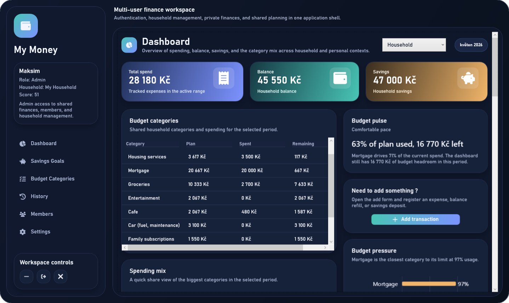

---

## Table of contents

- [Key features](#key-features)
- [Tech stack](#tech-stack)
- [Architecture](#architecture)
- [Data model](#data-model)
- [Roles and access control](#roles-and-access-control)
- [Analytics and Financial Health Score](#analytics-and-financial-health-score)
- [Screenshots](#screenshots)
- [Getting started](#getting-started)
- [Testing](#testing)
- [Documentation](#documentation)
- [License](#license)
- [Author](#author)

---

## Key features

- **Multi-user households.** A single workspace shared by several users, each signing in with their own account, under a household model with distinct roles and permissions.
- **Role-based access control.** Three roles — Admin, Partner, Child — with additional per-member permissions (`CanManageBudget`, `CanManageMembers`). Access is enforced in both the UI and the service layer, not only by hiding buttons.
- **Personal and shared finance contexts.** Records, categories, and savings goals belong either to the whole household or to an individual user, and the same screens adapt to the active context.
- **Financial records with transactional consistency.** Adding or deleting a record and updating the related balance or savings happen inside a single database transaction, so data never ends up half-written.
- **Budget planning.** Per-category planned amounts compared against real spending, with clear visual pressure indicators.
- **Savings goals.** Create, track, and contribute to shared or personal goals with progress tracking.
- **Explainable analytics engine.** A rule-based engine evaluates budget pressure, spending trends, savings runway, and goal progress, and produces categorized insights — Warning, Advice, Observation, Praise — each with a "detected / why it matters / what to do" explanation.
- **Financial Health Score.** A 0–100 score derived from a weighted model (budget discipline, savings, expense stability, goal progress), computed differently for adults and children for fairer comparison.
- **Authentication and account recovery.** Password hashing with PBKDF2, temporary-password email flow for account creation and recovery, and a forced password change on first login.

---

## Tech stack

| Layer | Technology |
|-------|-----------|
| Language / runtime | C#, .NET 10 |
| UI | WPF, XAML, MVVM |
| Charts | LiveChartsCore (SkiaSharp) |
| Dependency injection | Microsoft.Extensions.DependencyInjection |
| Database | SQLite (System.Data.SQLite) |
| Security | PBKDF2 (Rfc2898DeriveBytes), constant-time hash comparison |
| Testing | xUnit |
| Icons | FontAwesome.Sharp |

---

## Architecture

The application follows a layered architecture with a clear separation of responsibilities. The UI (Views + ViewModels) never talks to the database directly: ViewModels call services, services hold the business logic and access rules, and repositories encapsulate all SQL against SQLite.

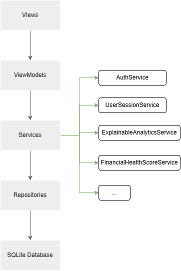

- **Views / ViewModels** — MVVM presentation layer. ViewModels manage screen state, react to user actions, and prepare data for display.
- **Services** — the core of the application. This is where registration, sessions, role and permission checks, financial operations, the analytics engine, and the health-score calculation live.
- **Repositories** — direct communication with SQLite; each repository owns a group of entities and its CRUD operations.
- **Dependency injection** — services, repositories, and ViewModels are registered at startup and injected where needed, keeping components loosely coupled and testable.

---

## Data model

The schema is built around a household that several users belong to, with finance data split into personal and shared contexts.

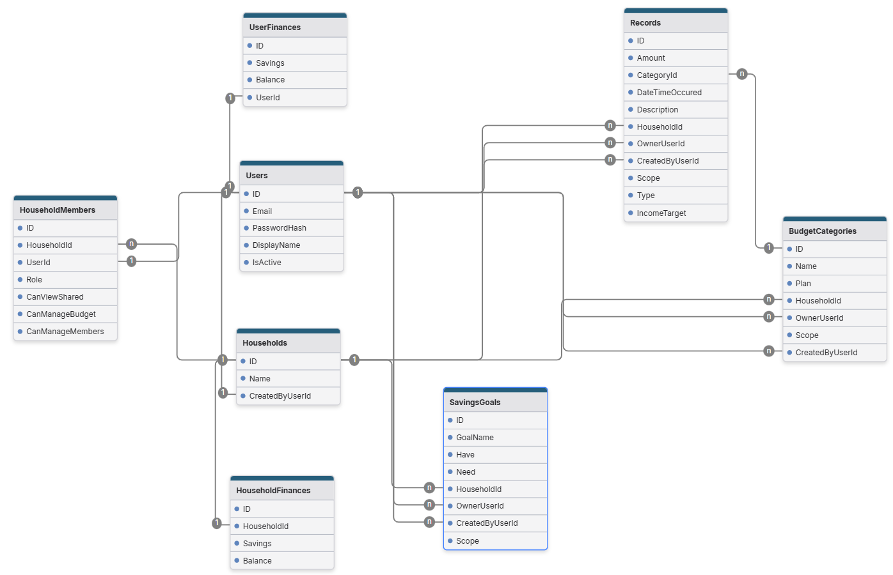

Core entities: `User`, `Household`, and `HouseholdMember` (which carries the member's role and permissions). Financial state is stored separately as `HouseholdFinance` and `UserFinance` so shared and personal money can be tracked independently. `Record`, `BudgetCategory`, and `SavingsGoal` each carry a scope and ownership so the service layer can determine who created an item, who it belongs to, and what actions are allowed on it.

---

## Roles and access control

My Money supports three roles, plus fine-grained permissions on top of them:

- **Admin** — full control of the household: manage members, roles, permissions, and child account passwords.
- **Partner** — an adult member who works with personal and shared data within their assigned permissions.
- **Child** — a restricted account limited to the shared context: cannot access personal finances, cannot manage members, cannot delete history, and has limited savings-goal permissions (can create and contribute to shared goals, edit only goals they created).

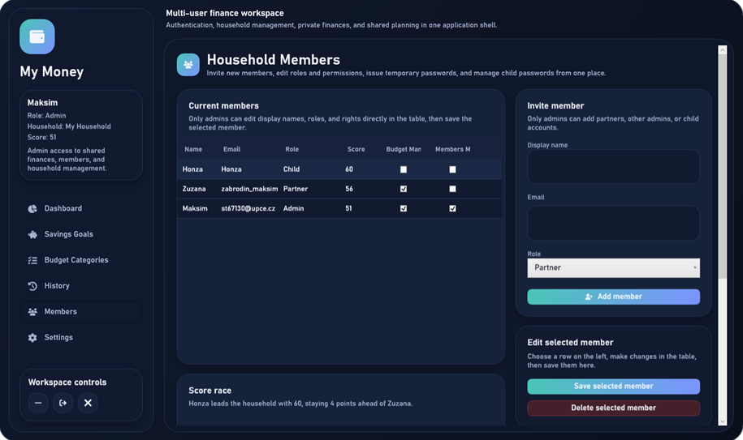

Restrictions are enforced twice — once in the UI (hidden or disabled actions) and again in the service layer, which decides whether an operation is actually allowed to run.

The use-case diagram below summarizes what each actor can do:

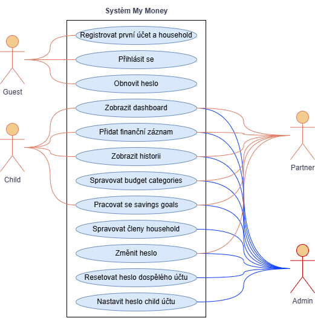

---

## Analytics and Financial Health Score

The dashboard is the analytical center of the app. Beyond raw balances, it visualizes spending structure, budget pressure, and monthly trends, and pairs them with a written interpretation of the current situation.

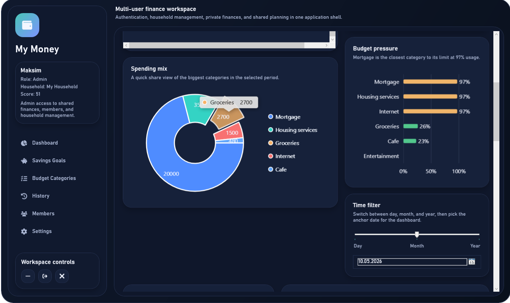

The **explainable analytics engine** is rule-based rather than machine-learning-based, so every recommendation can be traced back to the data and rule that produced it. Insights are categorized as Warning, Advice, Observation, or Praise, and prioritized so the most important ones surface first.

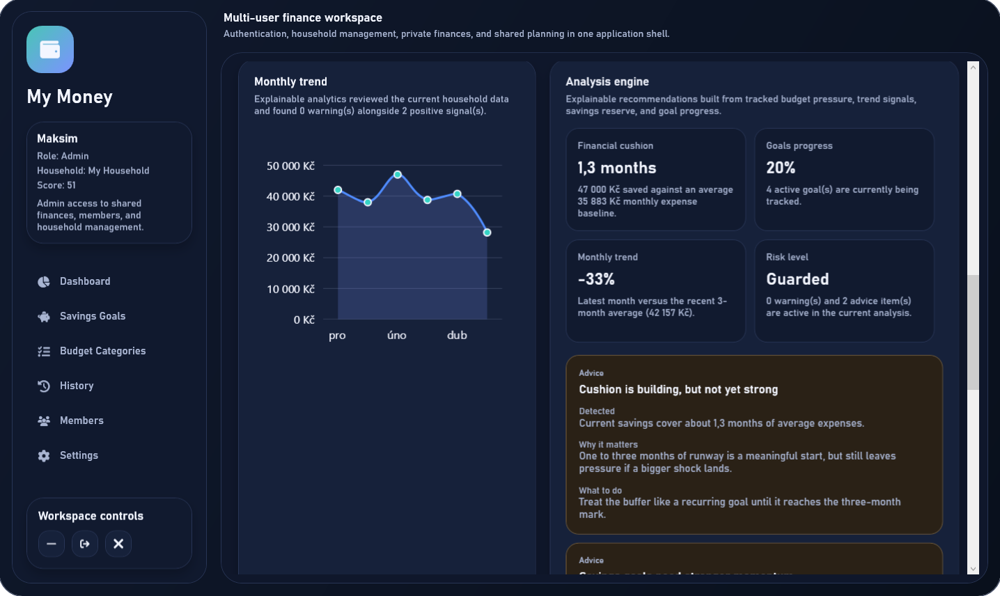

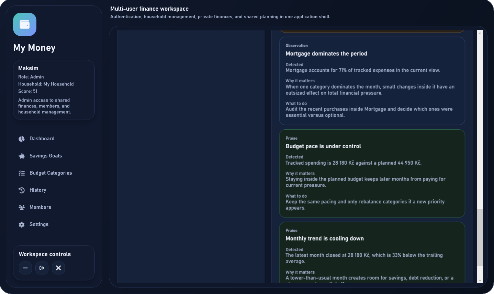

The **Financial Health Score** condenses financial behavior into a 0–100 value using a weighted model — budget discipline (35%), savings (25%), expense stability (20%), and goal progress (20%) — with different logic for adults and children so members can be compared fairly.

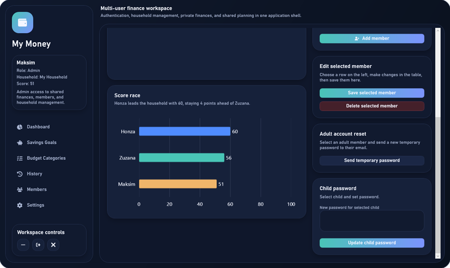

---

## Screenshots

<details>
<summary>Click to expand the full screen gallery</summary>

### Login and household access
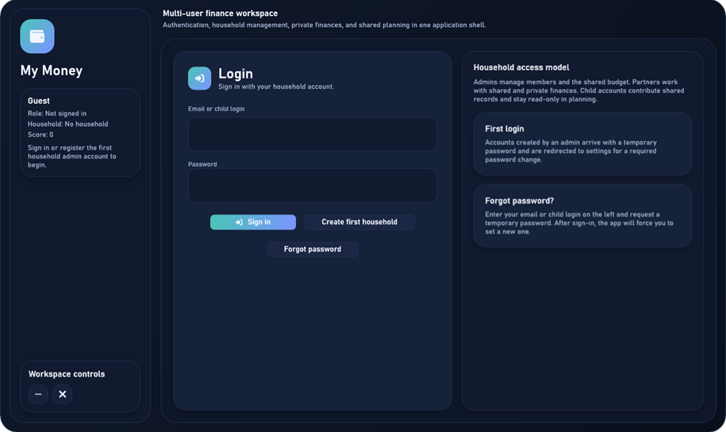

### Household dashboard


### Personal dashboard
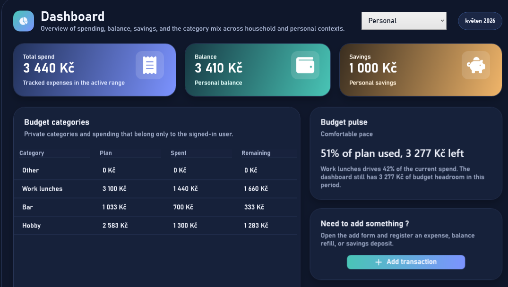

### Budget plan
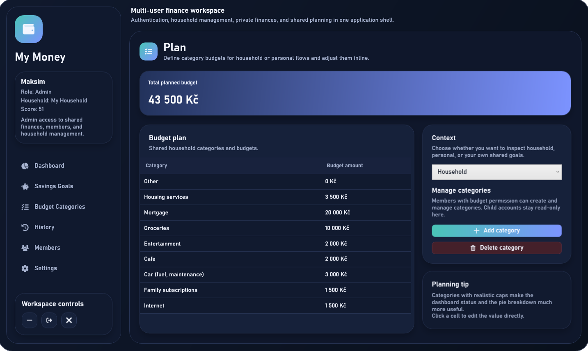

### Add entry
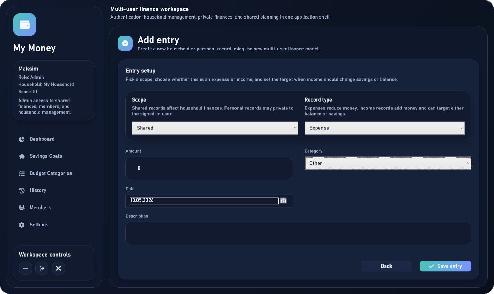

### History
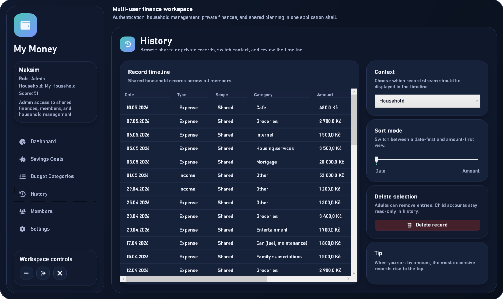

### Savings goals (Moneybox)
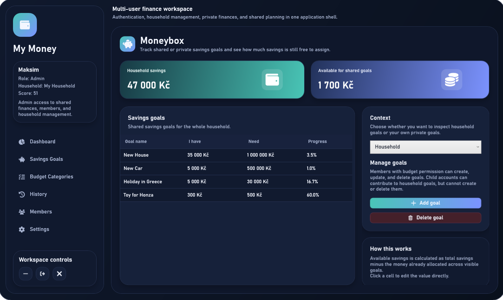


</details>

---

## Getting started

### Prerequisites

- Windows 10 (build 19041) or later
- [.NET 10 SDK](https://dotnet.microsoft.com/download) (Windows desktop workload)
- Visual Studio 2022+ recommended (for WPF tooling)

### Run from source

```bash
git clone https://github.com/Zabrodin-Maksim/My_money_APP.git
cd My_money_APP
git checkout multi-user
dotnet build
dotnet run --project My_money
```

Open `My_money.sln` in Visual Studio as an alternative. On first launch, the app has no users — register the first account, which creates the household and becomes its Admin.

### Prebuilt installer

A packaged installer is available in the repository: `My_money_Setup.rar`. Unzip it and run `setup.exe`.

> The application adapts its currency formatting to the region configured in Windows.

---

## Testing

Unit tests live in the `My_money.Tests` project (xUnit) and focus on the analytics logic in `ExplainableAnalyticsService` — the part with the most branching rules, thresholds, and input combinations.

```bash
dotnet test
```

---

## Documentation

The full bachelor's thesis describing the analysis, architecture, data model, UI design, and implementation is included in the repository:

- [`Documentation.pdf`](Documentation.pdf)
- [`BP_Zabrodin.docx`](BP_Zabrodin.docx)

---

## License

This work is licensed under the **Creative Commons Attribution-NonCommercial-NoDerivatives 4.0 International License (CC BY-NC-ND 4.0)**.

You are free to share (copy and redistribute) the material in any medium or format, under the following terms: attribution, non-commercial use only, and no derivatives. Full text: <http://creativecommons.org/licenses/by-nc-nd/4.0/>

---

## Author

**Maksim Zabrodin**
- Email: zabrodin_maksim1@outlook.com
- GitHub: [github.com/Zabrodin-Maksim](https://github.com/Zabrodin-Maksim)
- LinkedIn: [linkedin.com/in/maksim-zabrodin](https://www.linkedin.com/in/maksim-zabrodin/)
